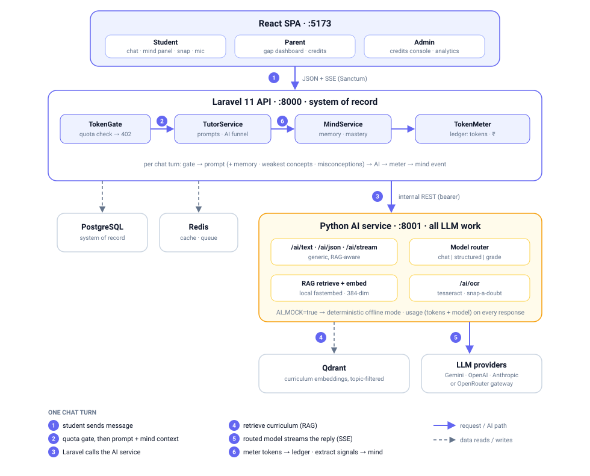
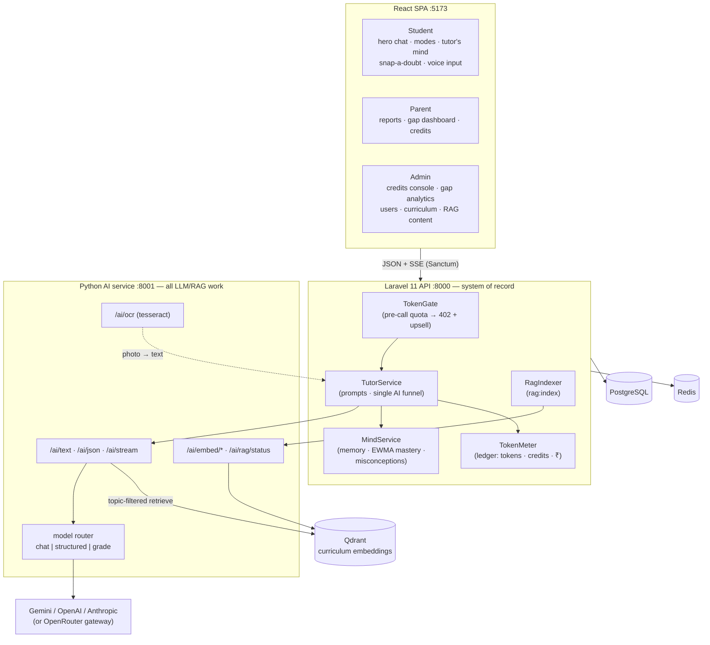

# Everything AI Tutor — Full-Stack Build

An AI learning operating system for Indian school students (CBSE-first), built on the PRD service architecture:

**React (Vite) SPA · Laravel 11 API (system of record) · Python FastAPI AI service (all LLM/RAG work) · PostgreSQL · Redis · Qdrant**

Three roles — **Student, Parent, Admin** — around one core adaptive loop:

> **Learn → Assess → Gap analysis → Re-teach the gaps → Re-assess → Mastery**

---

## Architecture



```
                ┌────────────────────────────────────────────────────────┐
                │                  React SPA (Vite, :5173)               │
                │   Student: hero chat (modes · mind panel · snap/mic)   │
                │   Parent: reports · gap dashboard · credit usage       │
                │   Admin: users · curriculum · credits · gap analytics  │
                └───────────────────────────┬────────────────────────────┘
                                            │ HTTPS/JSON + SSE (Sanctum bearer)
                ┌───────────────────────────▼────────────────────────────┐
                │               Laravel 11 API (:8000)                   │
                │  TokenGate (pre-call quota)  →  controllers            │
                │  TutorService (prompts, single AI funnel)              │
                │  MindService (memory · EWMA mastery · misconceptions)  │
                │  TokenMeter (post-call ledger: tokens, credits, ₹)     │
                │  RagIndexer (curriculum → vector store)                │
                └──────┬──────────────────┬──────────────────┬───────────┘
                       │ SQL              │ cache/queue      │ REST (bearer, internal)
                ┌──────▼──────┐    ┌──────▼──────┐    ┌──────▼──────────────────────┐
                │ PostgreSQL  │    │    Redis    │    │  Python AI service (:8001)  │
                │ system of   │    │             │    │  /ai/text /ai/json /ai/stream│
                │ record      │    │             │    │  /ai/ocr  /ai/embed/*  roles │
                └─────────────┘    └─────────────┘    │  model routing · mock mode   │
                                                      └───┬──────────┬───────────────┘
                                                          │ RAG      │ routed LLM calls
                                                   ┌──────▼─────┐ ┌──▼────────────────┐
                                                   │   Qdrant   │ │ Gemini / OpenAI / │
                                                   │ (curriculum│ │ Anthropic /       │
                                                   │ embeddings)│ │ OpenRouter        │
                                                   └────────────┘ └───────────────────┘
```



**Key invariants**

- **Laravel never calls an LLM directly.** Every AI call goes through `AiClient` → the Python service, which returns real token usage on every response.
- **Every AI call is gated before and metered after.** `token.gate:{action}` blocks over-quota requests with `402 + upsell`; `TokenMeter` writes the `token_ledger` (real tokens + ₹ from `model_rates`) and bumps daily/monthly credit counters.
- **Students and parents see credits, never raw tokens or ₹** — those are admin-only.
- **RAG never breaks a chat turn.** If Qdrant is empty or down, retrieval returns `[]` and the tutor answers ungrounded.
- **Mock mode end to end.** `AI_MOCK=true` (or no API key) runs the entire product loop with zero external calls.

---

## Repository layout

```
ai-tutor-new/
├── ai-service/          Python FastAPI — all LLM / RAG / OCR / embeddings
│   └── app/             config (provider+routing) · llm facade · providers
│                        (Gemini/OpenAI/Anthropic) · rag (Qdrant+fastembed) ·
│                        prompts · mock · main (endpoints)
├── backend/             Laravel 11 overlay (scaffolded at build by setup.sh/Docker)
│   ├── app/Services/    AiClient · TutorService · MindService · TokenMeter ·
│   │                    RagIndexer · ProgressService
│   ├── app/Http/        TokenGate middleware · API controllers (incl. AdminUsage,
│   │                    AdminGap, AdminContent)
│   └── database/        migrations (curriculum, chat, assessments, token metering,
│                        content_chunks, memory/mastery/misconceptions) · seeders
├── frontend/            React + Vite SPA (Tailwind, role-based)
│   └── src/screens/     student (TutorChat + TutorMind, AssessmentFlow) ·
│                        parent (dashboard + gap/credit views) ·
│                        admin (CreditsPanel, GapAnalytics, Curriculum, Users)
├── docker-compose.yml   6 services: postgres · redis · qdrant · ai-service ·
│                        backend · frontend
├── AI_Tutor_*.md        Product / architecture / chat-page / token specs
└── REARCHITECTURE_NOTES.md   How the build evolved, step by step
```

---

## What each role can do

| Role | Capabilities |
|------|--------------|
| **Student** | Hero tutor chat — 5 tutor modes (Teach / Socratic / Quiz / Exam drill / ELI10), streaming replies with LaTeX math, **"tutor's mind" panel** (live EWMA concept mastery, misconceptions caught open→fixed, what the tutor remembers, next step), **snap-a-doubt** (photo → OCR → taught solution), **voice input**, chat rename/history/transcripts, mini-assessments with gap detection, next-step plans, credit meter, progress. |
| **Parent**  | Link children; per-child report with plain-language summary; **advanced gap dashboard** (severity mix, new-vs-closed trend, mastery by topic with weakest concepts, misconceptions open→fixed, tutor recommendations); **AI usage card** (plan, daily/monthly credit bars, by-action breakdown — credits only). |
| **Admin**   | Platform stats; user management; curriculum manager (Stage→Track→Level→Subject→Chapter→Topic); **RAG content manager** (chunks per topic + reindex); **credits console** (usage trend, cost by action/model, top consumers with inline plan switch + audited credit grants, plan editor with per-action weights, model rates); **gap analytics** (most-failed concepts, created-vs-resolved trend, students at risk, cohort mastery, recurring misconceptions). Raw tokens + ₹ are visible only here. |

---

## The adaptive loop (how the AI works)

1. **Tutor chat** — `TutorService` builds a topic-scoped pedagogical prompt (mode rules + the student's *mind context*: memory, weakest concepts, open misconceptions) and streams via `/ai/stream`, grounded in retrieved curriculum chunks when the topic is indexed.
2. **The tutor's mind** — after every reply, a cheap grade-routed call extracts structured signals: concept tags + a mastery signal (EWMA per concept, α≈0.4 for assessments, 0.2 for chat), misconceptions **detected and resolved**, a next step, and durable memory facts. All of it feeds back into every future prompt and streams to the right-panel UI as a `mind` SSE event.
3. **Mini-assessment** — `/ai/json` produces diagnostic MCQs with misconception distractors (one automatic retry on transient failure).
4. **Gap analysis** — wrong answers go to the AI; gaps persist with severity + recommendation; concept mastery updates from hard evidence.
5. **Learning plan** — open gaps become 3–4 concrete next-step tasks; completing a task can auto-resolve the matching gap.
6. **Dashboards** — students see progress; parents see the gap dashboard; admins see cohort analytics (most-failed concepts = content-quality signal).

### Token / credit system

- Two layers, deliberately separate: **real tokens** (engineering/cost, `token_ledger`, ₹ from `model_rates`) and **student-facing credits** (abstract units, per-action weights on plans).
- Plans: Free (30/day) · Plus (200/day) · Family — limits and weights are admin-editable live.
- Out of credits → friendly 402 wall, never a dead end; `credit_grants` raise the month's ceiling with an audit trail.

### Multi-provider LLM + routing

```bash
AI_PROVIDER=auto|gemini|openai|anthropic     # auto = first provider with a key
AI_MODEL=...                                 # single-model switch (beats everything)
AI_MODEL_CHAT=... AI_MODEL_STRUCTURED=... AI_MODEL_GRADE=...   # per-action routing
OPENAI_BASE_URL=https://openrouter.ai/api/v1 # OpenRouter gateway works via openai provider
```

Usage reports the **routed** model per call, so the ledger and ₹ stay accurate per action. 429s honor `Retry-After` with proper backoff (free-tier models rate-limit per minute).

### RAG

Curriculum chunks (`content_chunks`, admin-editable) → embedded with **local fastembed** (`BAAI/bge-small-en-v1.5`, 384-dim, no API key) → Qdrant, topic-filtered retrieval injected as a `<curriculum>` block. `php artisan rag:index` (runs at boot); verify with `GET :8001/ai/rag/status`.

---

## ▶️ Run it — Docker (one command)

```bash
cp .env.example .env        # add ONE provider key, or keep AI_MOCK=true
docker compose up --build
```

Starts **postgres, redis, qdrant, ai-service, backend, frontend**. The backend waits for Postgres, migrates + seeds once, then indexes seeded curriculum into Qdrant.

| URL | What |
|---|---|
| http://localhost:5173 | App |
| http://localhost:8000 | Laravel API |
| http://localhost:8001/health | AI service: provider, model routing, mock flag, embedder |
| http://localhost:8001/ai/rag/status | Vector store: enabled, dim, indexed point count |

**Demo accounts** (password `password`): `admin@tuto.ai` · `student@tuto.ai` · `student2@tuto.ai` · `parent@tuto.ai` (linked to both students).

### Manual (no Docker)

```bash
# backend (scaffolds Laravel 11 into backend/.laravel, overlays, migrates + seeds)
cd backend && ./setup.sh && cd .laravel && php artisan serve            # :8000

# ai-service
cd ai-service && python3 -m venv .venv && ./.venv/bin/pip install -r requirements.txt
./.venv/bin/uvicorn app.main:app --port 8001                            # :8001

# frontend
cd frontend && npm install && npm run dev                               # :5173
```

---

## Environment variables (root `.env`)

| Var | Meaning |
|---|---|
| `AI_PROVIDER` | `auto` \| `gemini` \| `openai` \| `anthropic` |
| `GEMINI_API_KEY` / `OPENAI_API_KEY` / `ANTHROPIC_API_KEY` | provider keys (one is enough) |
| `OPENAI_BASE_URL` | OpenAI-compatible gateway (OpenRouter) |
| `AI_MOCK` | `true` = run everything offline with deterministic mock AI |
| `AI_MODEL`, `AI_MODEL_CHAT/STRUCTURED/GRADE` | model routing (see above) |
| `EMBED_BACKEND` | `auto` (prefers local fastembed) \| `local` \| `gemini` \| `openai` \| `mock` |
| `LLM_TIMEOUT` / `AI_SERVICE_TIMEOUT` | per-request LLM timeout (s) / Laravel→AI-service timeout (s) — keep the second larger |
| `DB_PASSWORD`, `INTERNAL_API_KEY` | Postgres password · shared Laravel↔AI-service secret |

---

## API surface (selected)

```
POST /api/register /api/login /api/logout            GET /api/me

# Student
POST  /api/tutor/sessions                            start/resume topic chat
POST  /api/tutor/sessions/{id}/stream                send → streamed reply + mind event   [gate: chat]
GET   /api/tutor/sessions/{id}/mind                  tutor's mind payload
PATCH /api/tutor/sessions/{id}                       rename chat
POST  /api/tutor/snap                                photo → OCR text                     [gate: snap]
POST  /api/assessments/generate                      diagnostic MCQs                      [gate: assess_gen]
POST  /api/assessments/{id}/submit                   grade + EWMA + gap analysis + mind   [gate: gap]
POST  /api/plans/generate                            next-step plan                       [gate: plan]
GET   /api/progress  /api/usage                      snapshot · credit meter

# Parent
GET /api/parent/children
GET /api/parent/children/{id}/report                 report + AI plain-language summary
GET /api/parent/children/{id}/gaps                   advanced gap dashboard
GET /api/parent/children/{id}/usage                  credits (never tokens/₹)

# Admin
GET   /api/admin/stats /users /gaps /usage           analytics (tokens + ₹ only here)
PATCH /api/admin/users/{id}/plan                     switch a student's plan
POST  /api/admin/users/{id}/grant-credits            audited top-up
GET/PATCH /api/admin/plans                           plan editor (limits + weights)
GET/POST  /api/admin/model-rates                     provider pricing
GET/POST/PATCH/DELETE /api/admin/topics/{t}/content  RAG knowledge base + reindex
CRUD  /api/admin/curriculum/*                        Stage→…→Topic

# Internal: Laravel → AI service (:8001, bearer INTERNAL_API_KEY)
POST /ai/text /ai/json /ai/stream                    generic, RAG-aware, action-routed
POST /ai/ocr                                         tesseract OCR (snap-a-doubt)
POST /ai/embed/index /ai/embed/ensure /ai/embed/delete-topic
GET  /health /ai/rag/status
```

---

## Troubleshooting

| Symptom | Cause / fix |
|---|---|
| "Couldn't generate a quiz" | Free models rate-limit per minute. The stack retries with `Retry-After` backoff + one regenerate; wait a few seconds and use **Try again**. For reliability set `AI_MODEL_STRUCTURED` to a paid model. |
| Login fails right after first boot | Seeding may still be running — wait for "Seeded demo accounts" in the logs. |
| `Duplicate table: personal_access_tokens` | Fixed: the Sanctum migration is pinned + guarded; old volumes reconcile on next boot. |
| Tutor ignores curriculum | Only topics with indexed `content_chunks` are grounded. Add content in Admin and run `php artisan rag:index`; check `/ai/rag/status` points count. |
| `onnxruntime cpuid` warning in ai-service | Harmless fastembed notice on Apple-silicon Docker. |

## Security notes

- Rotate any API keys that were shared in chat before deploying anywhere public.
- `INTERNAL_API_KEY` guards the AI service; set a real secret outside local dev.
- Parents only access children linked via the guardianship table; role middleware everywhere.

## Mobile reuse

The API is plain JSON + bearer tokens — the same endpoints power a React Native / Flutter app with no backend changes.
